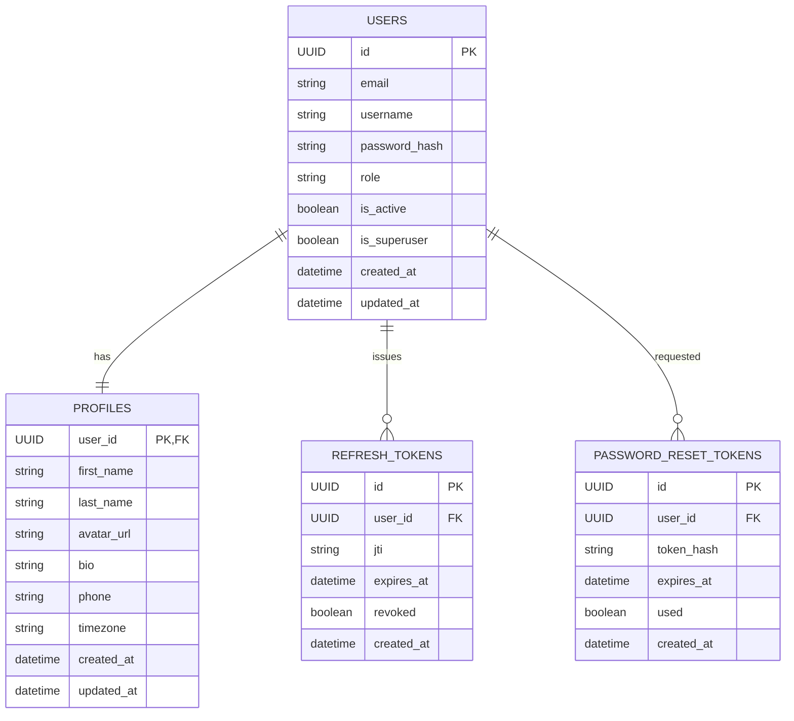

# FastAPI Backend Project Design

## 1. Overview

This document outlines the design for a FastAPI backend service with a repository/service architecture pattern. The system will implement user authentication, profile management, and role-based access control (RBAC) using modern Python tools and best practices.

### Key Features
- User authentication with JWT tokens
- Profile management system
- Role-based access control (client, executor, admin)
- Password reset functionality with email verification
- Database migrations with Alembic
- Dependency injection with Dishka

### Project Structure
```
app/
  core/
    config.py          # Application configuration
    security.py        # Password hashing and verification
    jwt.py             # JWT token creation and validation
    email.py           # Email sending functionality
  db/
    base.py            # Base database models
    session.py         # Database session management
  domain/
    users/
      models.py        # User database model
      schemas.py       # User Pydantic schemas
      repository.py    # User data access layer
      service.py       # User business logic
      router.py        # User API endpoints
      enums.py         # User-related enums
      policies.py      # User access policies
    profiles/
      models.py        # Profile database model
      schemas.py       # Profile Pydantic schemas
      repository.py    # Profile data access layer
      service.py       # Profile business logic
      router.py        # Profile API endpoints
    auth/
      router.py        # Authentication API endpoints
      schemas.py       # Auth Pydantic schemas
      service.py       # Authentication business logic
      repository.py    # Auth data access layer
  di/
    container.py       # Dependency injection container
  api/
    deps.py            # API dependencies
    router.py          # Main API router
  utils/
    crypto.py          # Cryptographic utilities
    exceptions.py      # Custom exceptions
  main.py              # Application entry point
alembic/
  env.py               # Alembic configuration
  versions/            # Database migration scripts
tests/
  test_auth.py         # Authentication tests
  test_users.py        # User functionality tests
  test_profiles.py     # Profile functionality tests
.env.example           # Environment variables example
README.md              # Project documentation
```

### Core Modules Implementation

#### app/core/config.py
- Load environment variables using pydantic-settings
- Define configuration models for different parts of the application
- Provide type-safe access to configuration values

#### app/core/security.py
- Password hashing using Passlib
- Password verification functions
- Password strength validation

#### app/core/jwt.py
- JWT token creation and validation
- Token expiration handling
- JTI (JWT ID) management for revocation

#### app/core/email.py
- SMTP configuration and connection management
- Email template rendering
- Async email sending functionality

#### app/db/base.py
- Base model class for SQLAlchemy
- Common model attributes (created_at, updated_at)
- Model metadata configuration

#### app/db/session.py
- Database engine configuration
- Async session factory
- Session management utilities

## 2. Technology Stack

- **Framework**: FastAPI (Python 3.11+)
- **ASGI Server**: Uvicorn
- **Database**: SQLite with SQLAlchemy 2.0 (AsyncSession)
- **Migrations**: Alembic
- **Dependency Injection**: Dishka
- **Data Validation**: Pydantic v2
- **Security**: Passlib (bcrypt/argon2), PyJWT
- **Email**: aiosmtplib
- **Configuration**: python-dotenv
- **Testing**: pytest, httpx, pytest-asyncio
- **Code Quality**: ruff, black, mypy

## 3. Project Architecture

```
app/
  core/
    config.py          # Application configuration
    security.py        # Password hashing and verification
    jwt.py             # JWT token creation and validation
    email.py           # Email sending functionality
  db/
    base.py            # Base database models
    session.py         # Database session management
  domain/
    users/
      models.py        # User database model
      schemas.py       # User Pydantic schemas
      repository.py    # User data access layer
      service.py       # User business logic
      router.py        # User API endpoints
      enums.py         # User-related enums
      policies.py      # User access policies
    profiles/
      models.py        # Profile database model
      schemas.py       # Profile Pydantic schemas
      repository.py    # Profile data access layer
      service.py       # Profile business logic
      router.py        # Profile API endpoints
    auth/
      router.py        # Authentication API endpoints
      schemas.py       # Auth Pydantic schemas
      service.py       # Authentication business logic
      repository.py    # Auth data access layer
  di/
    container.py       # Dependency injection container
  api/
    deps.py            # API dependencies
    router.py          # Main API router
  utils/
    crypto.py          # Cryptographic utilities
    exceptions.py      # Custom exceptions
  main.py              # Application entry point
alembic/
  env.py               # Alembic configuration
  versions/            # Database migration scripts
tests/
  test_auth.py         # Authentication tests
  test_users.py        # User functionality tests
  test_profiles.py     # Profile functionality tests
.env.example           # Environment variables example
README.md              # Project documentation
```

## 4. Data Models

### Entity Relationship Diagram



### User Model
- `id`: UUID (Primary Key)
- `email`: String (Unique, Indexed)
- `username`: String (Unique, Indexed)
- `password_hash`: String
- `role`: Enum (client | executor | admin)
- `is_active`: Boolean
- `is_superuser`: Boolean
- `created_at`: DateTime
- `updated_at`: DateTime
- Relationship: One-to-One with Profile

### Profile Model
- `user_id`: UUID (Primary Key, Foreign Key to users.id)
- `first_name`: String
- `last_name`: String
- `avatar_url`: String
- `bio`: String
- `phone`: String
- `timezone`: String
- `created_at`: DateTime
- `updated_at`: DateTime
- Relationship: One-to-One with User

### Refresh Token Model
- `id`: UUID (Primary Key)
- `user_id`: UUID (Foreign Key to users.id)
- `jti`: String (JWT ID)
- `expires_at`: DateTime
- `revoked`: Boolean
- `created_at`: DateTime

### Password Reset Token Model
- `id`: UUID (Primary Key)
- `user_id`: UUID (Foreign Key to users.id)
- `token_hash`: String
- `expires_at`: DateTime
- `used`: Boolean
- `created_at`: DateTime

### Database Implementation Details

#### SQLAlchemy Models
All models will be implemented using SQLAlchemy 2.0 with async support:

1. **User Model**:
   - Uses UUID as primary key
   - Email and username have unique constraints and indexes
   - Password hashing using Passlib
   - Role field uses Python Enum
   - Timestamps with automatic update on modification

2. **Profile Model**:
   - Implements shared primary key pattern (user_id is both PK and FK)
   - One-to-one relationship with User model
   - All fields except user_id are optional

3. **Refresh Token Model**:
   - Tracks JWT IDs for token revocation
   - Expiration tracking
   - Revocation status

4. **Password Reset Token Model**:
   - One-time use tokens
   - Expiration tracking
   - Usage status tracking

#### Domain Modules Implementation

##### app/domain/users/
- **models.py**: SQLAlchemy User model with all required fields and relationships
- **schemas.py**: Pydantic models for user data validation and serialization
- **repository.py**: Data access layer with methods for user CRUD operations
- **service.py**: Business logic for user management
- **router.py**: API endpoints for user operations
- **enums.py**: User role enumeration (client, executor, admin)
- **policies.py**: Access control policies for user operations

##### app/domain/profiles/
- **models.py**: SQLAlchemy Profile model with shared primary key pattern
- **schemas.py**: Pydantic models for profile data validation and serialization
- **repository.py**: Data access layer with methods for profile CRUD operations
- **service.py**: Business logic for profile management
- **router.py**: API endpoints for profile operations

##### app/domain/auth/
- **schemas.py**: Pydantic models for authentication requests and responses
- **repository.py**: Data access layer for authentication-related operations
- **service.py**: Business logic for authentication flows
- **router.py**: API endpoints for authentication operations

## 5. API Endpoints

### Authentication
| Method | Endpoint | Description |
|--------|----------|-------------|
| POST | `/auth/register` | Register new user and create empty profile |
| POST | `/auth/login` | Authenticate user and return JWT tokens |
| POST | `/auth/refresh` | Refresh access token using refresh token |
| POST | `/auth/logout` | Revoke current refresh token |
| POST | `/auth/logout-all` | Revoke all refresh tokens for user |
| POST | `/auth/request-password-reset` | Request password reset email |
| POST | `/auth/confirm-password-reset` | Confirm password reset with token |

### Users
| Method | Endpoint | Description | Access |
|--------|----------|-------------|--------|
| GET | `/users/me` | Get current user (without profile) | Authenticated |
| GET | `/users/{id}` | Get specific user | Admin |
| PATCH | `/users/{id}` | Update specific user | Admin |
| GET | `/users` | List all users | Admin |

### Profiles
| Method | Endpoint | Description | Access |
|--------|----------|-------------|--------|
| GET | `/profiles/me` | Get current user's profile | Authenticated |
| PATCH | `/profiles/me` | Update current user's profile | Authenticated |
| GET | `/profiles/{user_id}` | Get specific user's profile | Admin |
| PATCH | `/profiles/{user_id}` | Update specific user's profile | Admin |

### API Implementation Details

#### Request/Response Schema

All endpoints will use Pydantic v2 for request validation and response serialization:

1. **Authentication Schemas**:
   - `UserRegisterRequest`: email, username, password
   - `UserLoginRequest`: email/username, password
   - `TokenResponse`: access_token, refresh_token, token_type
   - `PasswordResetRequest`: email
   - `PasswordResetConfirm`: token, new_password

2. **User Schemas**:
   - `UserCreate`: For creating users (admin only)
   - `UserUpdate`: For updating users (admin only)
   - `UserResponse`: Public user information
   - `UserListResponse`: For user listing

3. **Profile Schemas**:
   - `ProfileCreate`: For creating profiles
   - `ProfileUpdate`: For updating profiles
   - `ProfileResponse`: Profile information

#### Error Handling

All endpoints will follow consistent error response format:
```json
{
  "error": {
    "code": "ERROR_CODE",
    "message": "Human readable error message",
    "details": {}
  }
}
```

Common error codes:
- `VALIDATION_ERROR`: Request validation failed
- `AUTHENTICATION_ERROR`: User not authenticated
- `AUTHORIZATION_ERROR`: User not authorized for action
- `NOT_FOUND`: Resource not found
- `CONFLICT`: Resource conflict (e.g., duplicate email)
- `INTERNAL_ERROR`: Unexpected server error

#### API Modules Implementation

##### app/api/deps.py
- Authentication dependency functions
- Role-based access control dependencies
- Database session dependency
- Current user dependency with role validation

##### app/api/router.py
- Main API router that includes all domain routers
- API versioning (v1)
- Exception handlers registration
- Middleware configuration

##### app/main.py
- FastAPI application instance creation
- Middleware configuration
- CORS setup
- Exception handlers
- Router inclusion
- Dependency container initialization

## 6. Security & Authentication

### JWT Configuration
- Access Token TTL: 15 minutes
- Refresh Token TTL: 30 days
- JTI (JWT ID) stored in database for token revocation
- Refresh token rotation configurable via environment variables

### Password Security
- Passwords hashed using Passlib with bcrypt/argon2
- Password reset tokens are single-use with 1-hour TTL

### Email Functionality
- SMTP implementation using aiosmtplib
- Password reset emails contain links: `https://frontend/reset?token=...`
- SMTP can be mocked in development environments

### RBAC Implementation
- Roles: client, executor, admin
- Clients and executors can only access their own profiles
- Admins have full CRUD access to all users and profiles
- Access policies implemented in `policies.py`
- Dependencies implemented in `deps.py`

### Security Implementation Details

#### JWT Token Structure
Access tokens will contain:
- `sub`: User ID
- `email`: User email
- `role`: User role
- `exp`: Expiration timestamp
- `iat`: Issued at timestamp
- `jti`: JWT ID

Refresh tokens will contain:
- `sub`: User ID
- `jti`: JWT ID
- `exp`: Expiration timestamp
- `iat`: Issued at timestamp

#### Token Revocation
- Refresh tokens are stored in the database with JTI for revocation
- Logout endpoints mark tokens as revoked
- Tokens automatically expire after their TTL

#### Password Requirements
- Minimum 8 characters
- Must contain at least one uppercase letter
- Must contain at least one lowercase letter
- Must contain at least one digit
- Must contain at least one special character

#### Rate Limiting
- Authentication endpoints will be rate-limited to prevent brute-force attacks
- Password reset requests will be rate-limited per email
- General API rate limiting for all endpoints

## 7. Database Migrations

### Alembic Configuration
- Configured to use SQLAlchemy AsyncEngine
- Initial migration creates all required tables:
  - users
  - profiles
  - refresh_tokens
  - password_reset_tokens
- Profiles table implements shared primary key pattern (user_id as both PK and FK)

### Migration Implementation Details

#### Environment Configuration
The `alembic/env.py` file will be configured to:
1. Load database URL from environment variables
2. Set up async engine for SQLAlchemy 2.0
3. Configure target metadata from SQLAlchemy models
4. Set up logging for migration operations

#### Initial Migration
The first migration will create tables with the following structure:

1. **Users Table**:
   - Primary key: `id` (UUID)
   - Unique constraints on `email` and `username`
   - Indexes on `email` and `username` for performance
   - Foreign key relationships for related tables

2. **Profiles Table**:
   - Primary key: `user_id` (UUID) which is also a foreign key to users.id
   - All profile fields as optional strings
   - Timestamps for creation and updates

3. **Refresh Tokens Table**:
   - Primary key: `id` (UUID)
   - Foreign key: `user_id` (UUID) referencing users
   - Unique JTI field for token identification
   - Expiration timestamp
   - Revocation status boolean

4. **Password Reset Tokens Table**:
   - Primary key: `id` (UUID)
   - Foreign key: `user_id` (UUID) referencing users
   - Hashed token for security
   - Expiration timestamp
   - Usage status boolean

#### Migration Best Practices
- All migrations will be reversible (have both upgrade and downgrade functions)
- Migration names will follow descriptive naming convention
- Migrations will be tested in development before deployment
- Migration scripts will be version controlled

## 8. Dependency Injection

### Dishka Container
- Centralized dependency injection container in `di/container.py`
- Manages service lifecycles and dependencies
- Provides clean separation between layers

### DI Implementation Details

#### Container Configuration
The Dishka container will be configured to provide:

1. **Database Dependencies**:
   - `AsyncSession`: Database session for each request
   - `AsyncEngine`: Database engine
   - `MetaData`: Database metadata

2. **Service Dependencies**:
   - `UserService`: User business logic
   - `ProfileService`: Profile business logic
   - `AuthService`: Authentication business logic
   - `EmailService`: Email sending functionality

3. **Repository Dependencies**:
   - `UserRepository`: User data access
   - `ProfileRepository`: Profile data access
   - `AuthRepository`: Authentication data access

4. **Utility Dependencies**:
   - `JWTManager`: JWT token handling
   - `PasswordManager`: Password hashing and verification

#### Provider Registration
Providers will be registered with appropriate scopes:
- **Singleton**: For services that should be shared across the application
- **Request**: For dependencies that should be recreated for each request
- **Transient**: For dependencies that should be recreated each time they are requested

#### Integration with FastAPI
Dependencies will be injected into FastAPI routes using:
- `FromDishka` annotation for automatic injection
- Custom dependency providers for complex dependencies
- Middleware for request-scoped dependencies

## 9. Testing Strategy

### Test Structure
- `test_auth.py`: Authentication flow tests
- `test_users.py`: User management tests
- `test_profiles.py`: Profile management tests

### Testing Tools
- pytest for test framework
- httpx for API testing
- pytest-asyncio for async test support

### Testing Implementation Details

#### Test Organization
Tests will be organized following the AAA pattern (Arrange, Act, Assert):

1. **Unit Tests**:
   - Service layer tests
   - Repository layer tests
   - Utility function tests

2. **Integration Tests**:
   - API endpoint tests
   - Database integration tests
   - Authentication flow tests

3. **Test Fixtures**:
   - Database fixtures for testing
   - User fixtures with different roles
   - Authentication token fixtures

#### Test Database
- Separate SQLite database for testing
- Automatic database setup and teardown for each test
- Factory functions for creating test data

#### Test Coverage
Target coverage:
- Service layer: 90%+
- Repository layer: 90%+
- API endpoints: 80%+
- Utility functions: 90%+

#### Test Execution
- Parallel test execution where possible
- CI/CD integration for automated testing
- Test reporting with coverage metrics

## 10. Code Quality & Standards

### Linting & Formatting
- ruff for fast linting
- black for code formatting
- mypy for static type checking

### Project Setup
1. Create virtual environment with Python 3.11+
2. Install dependencies from requirements.txt
3. Configure environment variables using .env file
4. Run database migrations: `alembic upgrade head`
5. Start server: `uvicorn app.main:app --reload`

### Environment Configuration

The application will use python-dotenv for configuration management. The `.env.example` file will include:

```
# Database
DATABASE_URL=sqlite+aiosqlite:///./app.db

# Security
SECRET_KEY=your-secret-key-here
ALGORITHM=HS256
ACCESS_TOKEN_EXPIRE_MINUTES=15
REFRESH_TOKEN_EXPIRE_DAYS=30

# Password hashing
PASSWORD_HASH_SCHEME=bcrypt

# Email
SMTP_HOST=localhost
SMTP_PORT=1025
SMTP_USERNAME=
SMTP_PASSWORD=
EMAIL_FROM=noreply@example.com

# Application
DEBUG=True
ALLOWED_ORIGINS=http://localhost:3000,http://localhost:8000
```

### Utility Modules Implementation

#### app/utils/crypto.py
- Secure token generation functions
- Password strength validation
- Cryptographic utilities for sensitive operations

#### app/utils/exceptions.py
- Custom exception classes for different error types
- Exception handlers for consistent error responses
- Error code definitions

#### di/container.py
- Dishka container configuration
- Provider registration for all dependencies
- Scope configuration for different dependency types

### Code Quality Implementation Details

#### Code Style
- Follow PEP 8 style guide
- Use type hints for all function signatures
- Use descriptive variable and function names
- Keep functions small and focused
- Use docstrings for all public functions and classes

#### Static Analysis
- mypy for type checking with strict mode
- ruff for linting with comprehensive rule set
- bandit for security vulnerability scanning

#### Pre-commit Hooks
- black for automatic code formatting
- ruff for linting
- mypy for type checking
- pytest for running tests

#### Documentation
- Comprehensive docstrings for all modules
- API documentation automatically generated by FastAPI
- README with setup and usage instructions
- Inline comments for complex logic

### Acceptance Criteria
- [ ] Project starts successfully with `alembic upgrade head` and `uvicorn app.main:app --reload`
- [ ] All API endpoints function correctly
- [ ] RBAC policies are properly enforced
- [ ] Password reset via email works (with SMTP mock in development)
- [ ] User profiles are automatically created during registration

### Testing Scenarios

#### Authentication Tests
- User registration creates user and empty profile
- User login returns valid JWT tokens
- Refresh token rotation works correctly
- Logout revokes refresh token
- Logout-all revokes all refresh tokens
- Password reset request sends email
- Password reset confirmation updates password

#### User Management Tests
- Get current user returns user without profile
- Admin can get any user
- Admin can update any user
- Admin can list all users
- Non-admins cannot access admin endpoints

#### Profile Management Tests
- User can get their own profile
- User can update their own profile
- Admin can get any profile
- Admin can update any profile
- Non-admins cannot access other users' profiles

#### Security Tests
- Passwords are properly hashed
- JWT tokens expire correctly
- Refresh tokens are properly revoked
- RBAC policies are enforced
- Rate limiting works for auth endpoints

### Development Workflow
1. Create feature branch from main
2. Implement changes with tests
3. Run code quality checks
4. Commit with conventional commit messages
5. Create pull request for review
6. Merge after approval and CI passes

### Deployment Considerations

#### Production Configuration
- Use production database (PostgreSQL recommended)
- Set DEBUG=False
- Use strong SECRET_KEY
- Configure proper email service (SMTP)
- Set up proper logging configuration
- Configure CORS for production domains

#### Security Hardening
- HTTPS only in production
- Secure headers configuration
- Rate limiting for all endpoints
- Input validation and sanitization
- Secure password policies
- Regular security updates

#### Performance Optimization
- Database connection pooling
- Caching for frequently accessed data
- Async processing for email sending
- Proper indexing on database tables
- Query optimization

#### Monitoring and Observability
- Application logging
- Error tracking
- Performance monitoring
- Health check endpoints
- Database migration status monitoring