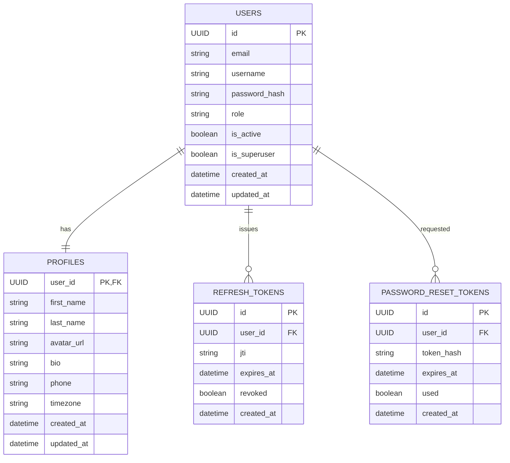

# FastAPI Backend Project Design

## 1. Overview

This document outlines the design for a FastAPI backend service with a repository/service architecture pattern. The system will implement user authentication, profile management, and role-based access control (RBAC) using modern Python tools and best practices.

### Key Features
- User authentication with JWT tokens
- Profile management system
- Role-based access control (client, executor, admin)
- Password reset functionality with email verification
- Database migrations with Alembic
- Dependency injection with Dishka

## 2. Technology Stack

- **Framework**: FastAPI (Python 3.11+)
- **ASGI Server**: Uvicorn
- **Database**: SQLite with SQLAlchemy 2.0 (AsyncSession)
- **Migrations**: Alembic
- **Dependency Injection**: Dishka
- **Data Validation**: Pydantic v2
- **Security**: Passlib (bcrypt/argon2), PyJWT
- **Email**: aiosmtplib
- **Configuration**: python-dotenv
- **Testing**: pytest, httpx, pytest-asyncio
- **Code Quality**: ruff, black, mypy

## 3. Project Architecture

```
app/
  core/
    config.py          # Application configuration
    security.py        # Password hashing and verification
    jwt.py             # JWT token creation and validation
    email.py           # Email sending functionality
  db/
    base.py            # Base database models
    session.py         # Database session management
  domain/
    users/
      models.py        # User database model
      schemas.py       # User Pydantic schemas
      repository.py    # User data access layer
      service.py       # User business logic
      router.py        # User API endpoints
      enums.py         # User-related enums
      policies.py      # User access policies
    profiles/
      models.py        # Profile database model
      schemas.py       # Profile Pydantic schemas
      repository.py    # Profile data access layer
      service.py       # Profile business logic
      router.py        # Profile API endpoints
    auth/
      router.py        # Authentication API endpoints
      schemas.py       # Auth Pydantic schemas
      service.py       # Authentication business logic
      repository.py    # Auth data access layer
  di/
    container.py       # Dependency injection container
  api/
    deps.py            # API dependencies
    router.py          # Main API router
  utils/
    crypto.py          # Cryptographic utilities
    exceptions.py      # Custom exceptions
  main.py              # Application entry point
alembic/
  env.py               # Alembic configuration
  versions/            # Database migration scripts
tests/
  test_auth.py         # Authentication tests
  test_users.py        # User functionality tests
  test_profiles.py     # Profile functionality tests
.env.example           # Environment variables example
README.md              # Project documentation
```

## 4. Data Models

### Entity Relationship Diagram



### User Model
- `id`: UUID (Primary Key)
- `email`: String (Unique, Indexed)
- `username`: String (Unique, Indexed)
- `password_hash`: String
- `role`: Enum (client | executor | admin)
- `is_active`: Boolean
- `is_superuser`: Boolean
- `created_at`: DateTime
- `updated_at`: DateTime
- Relationship: One-to-One with Profile

### Profile Model
- `user_id`: UUID (Primary Key, Foreign Key to users.id)
- `first_name`: String
- `last_name`: String
- `avatar_url`: String
- `bio`: String
- `phone`: String
- `timezone`: String
- `created_at`: DateTime
- `updated_at`: DateTime
- Relationship: One-to-One with User

### Refresh Token Model
- `id`: UUID (Primary Key)
- `user_id`: UUID (Foreign Key to users.id)
- `jti`: String (JWT ID)
- `expires_at`: DateTime
- `revoked`: Boolean
- `created_at`: DateTime

### Password Reset Token Model
- `id`: UUID (Primary Key)
- `user_id`: UUID (Foreign Key to users.id)
- `token_hash`: String
- `expires_at`: DateTime
- `used`: Boolean
- `created_at`: DateTime

## 5. API Endpoints

### Authentication
| Method | Endpoint | Description |
|--------|----------|-------------|
| POST | `/auth/register` | Register new user and create empty profile |
| POST | `/auth/login` | Authenticate user and return JWT tokens |
| POST | `/auth/refresh` | Refresh access token using refresh token |
| POST | `/auth/logout` | Revoke current refresh token |
| POST | `/auth/logout-all` | Revoke all refresh tokens for user |
| POST | `/auth/request-password-reset` | Request password reset email |
| POST | `/auth/confirm-password-reset` | Confirm password reset with token |

### Users
| Method | Endpoint | Description | Access |
|--------|----------|-------------|--------|
| GET | `/users/me` | Get current user (without profile) | Authenticated |
| GET | `/users/{id}` | Get specific user | Admin |
| PATCH | `/users/{id}` | Update specific user | Admin |
| GET | `/users` | List all users | Admin |

### Profiles
| Method | Endpoint | Description | Access |
|--------|----------|-------------|--------|
| GET | `/profiles/me` | Get current user's profile | Authenticated |
| PATCH | `/profiles/me` | Update current user's profile | Authenticated |
| GET | `/profiles/{user_id}` | Get specific user's profile | Admin |
| PATCH | `/profiles/{user_id}` | Update specific user's profile | Admin |

## 6. Security & Authentication

### JWT Configuration
- Access Token TTL: 15 minutes
- Refresh Token TTL: 30 days
- JTI (JWT ID) stored in database for token revocation
- Refresh token rotation configurable via environment variables

### Password Security
- Passwords hashed using Passlib with bcrypt/argon2
- Password reset tokens are single-use with 1-hour TTL

### Email Functionality
- SMTP implementation using aiosmtplib
- Password reset emails contain links: `https://frontend/reset?token=...`
- SMTP can be mocked in development environments

### RBAC Implementation
- Roles: client, executor, admin
- Clients and executors can only access their own profiles
- Admins have full CRUD access to all users and profiles
- Access policies implemented in `policies.py`
- Dependencies implemented in `deps.py`

## 7. Database Migrations

### Alembic Configuration
- Configured to use SQLAlchemy AsyncEngine
- Initial migration creates all required tables:
  - users
  - profiles
  - refresh_tokens
  - password_reset_tokens
- Profiles table implements shared primary key pattern (user_id as both PK and FK)

## 8. Dependency Injection

### Dishka Container
- Centralized dependency injection container in `di/container.py`
- Manages service lifecycles and dependencies
- Provides clean separation between layers

## 9. Testing Strategy

### Test Structure
- `test_auth.py`: Authentication flow tests
- `test_users.py`: User management tests
- `test_profiles.py`: Profile management tests

### Testing Tools
- pytest for test framework
- httpx for API testing
- pytest-asyncio for async test support

## 10. Code Quality & Standards

### Linting & Formatting
- ruff for fast linting
- black for code formatting
- mypy for static type checking

### Project Setup
1. Create virtual environment with Python 3.11+
2. Install dependencies from requirements.txt
3. Configure environment variables using .env file
4. Run database migrations: `alembic upgrade head`
5. Start server: `uvicorn app.main:app --reload`

### Acceptance Criteria
- [ ] Project starts successfully with `alembic upgrade head` and `uvicorn app.main:app --reload`
- [ ] All API endpoints function correctly
- [ ] RBAC policies are properly enforced
- [ ] Password reset via email works (with SMTP mock in development)
- [ ] User profiles are automatically created during registration